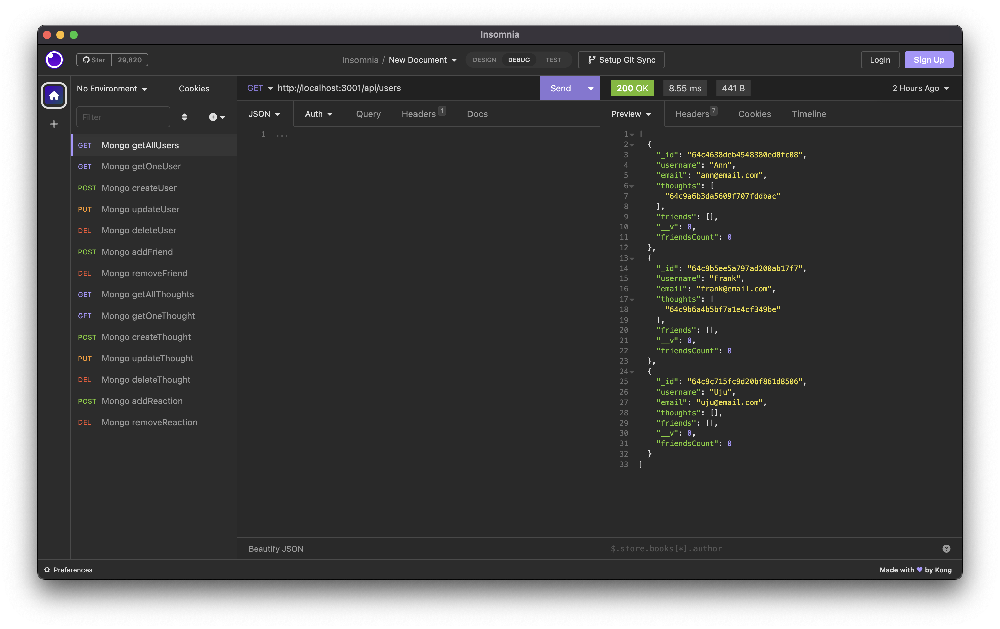
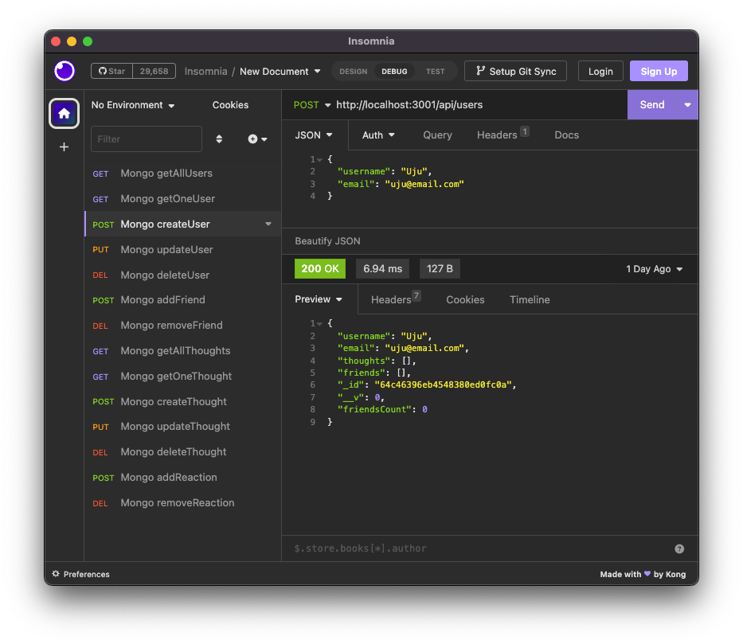
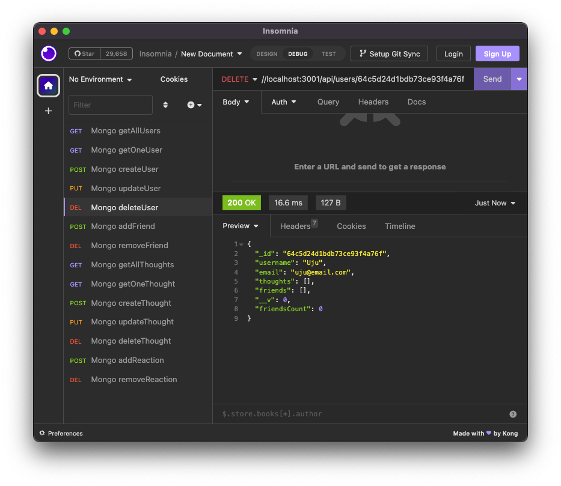
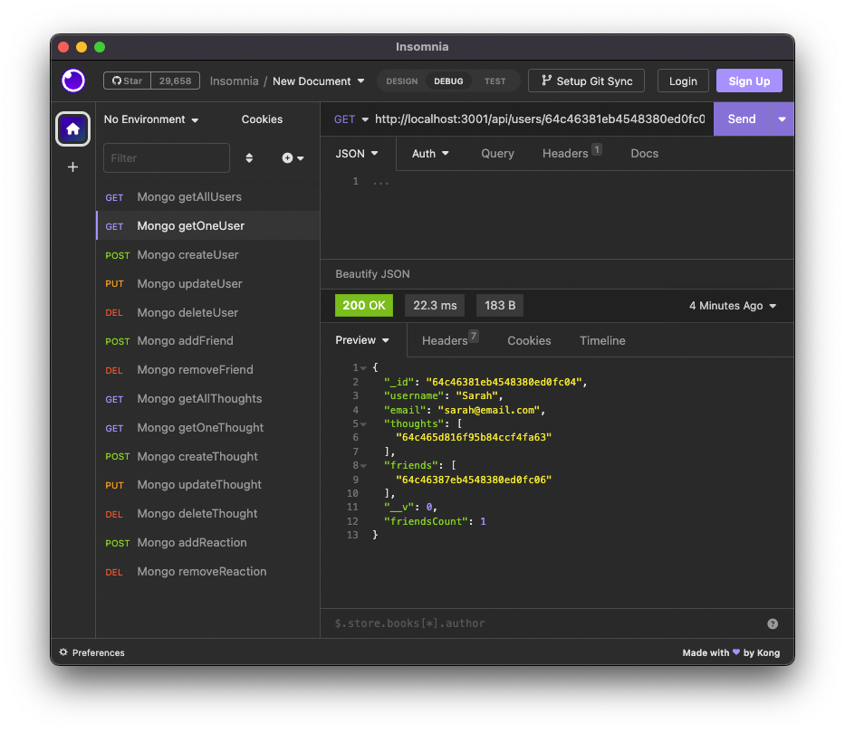
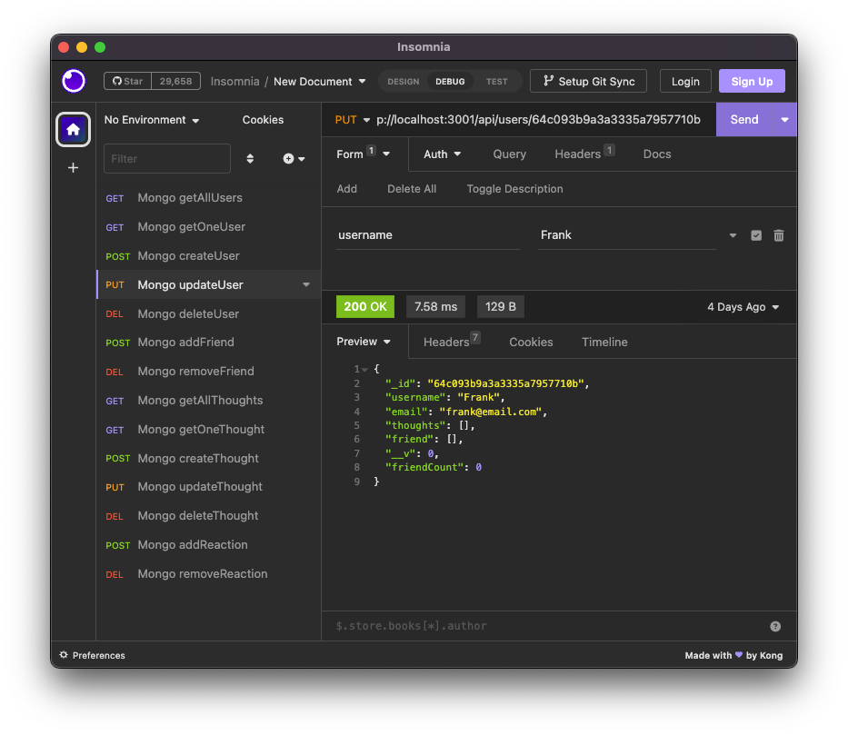

# NoSQL-Social-Network-API

NoSQL-MongoDB-Mongoose-Social-Network-API

Git Hub: https://github.com/minutemin/NoSQL-Social-Network-API

Video Link: https://drive.google.com/file/d/18uW91DaldmAS36wO0xVPRInqi8hPSK7t/view

## Description

This project was built to get more familiarity with NoSQL for a social network back end functionality using MongoDB and Mongoose with express.js and node.js.  

There was a log of troubleshooting with bugs for this project, which made me understand how to read error codes better, and to identify where the bug hides. But going through this process helped me get a better understanding on how routes, models, and controllers all tie with and work with each other. 

## Installation

All you will need to do is install npm and it's dependencies by running "npm i" in your CLI. 

## Usage

To use this back end app, after installing npm, run npm start or npm run dev if you want nodemon to make it run. You will then be able to perform CRUD in insomnia in order to enter data into the mongoDB. 

As a user, an account can be created in insomnia by using the POST method using the "../users" api URL.  You can get all users or one user using the GET method using the "../users" or "../users/:userId" for one user.  You can update any property of the user by using the PUT method with "../users/:userId" URL, and using the same URL path, you can use the DELETE method and enter the user's id in the url to delete the user from the mongoDB. 

Each user can add friends to their friend array and count.  To do so, you would use the POST method for adding freinds using the "../users/:userId/friends/:friendsId" url path. Using the same path, you can select the DELETE method for removing freinds, and it will remove that friend from the friends array and count.  

Users are able to create thoughts by using the POST method in the "../api/thoughts" api route. With the same url path, you can use the GET method to get all thoughts entered by all users.  If you want a specific thought, you can use the GET method and add the specific thoughts ID to the end of the url path "../thoughts/:thoguhtsId".  If you want to update a thought, using the same url path with the thoughts ID as the end point, use the PUT method and enter the changes in the thoughtText or username fields.  If you want to delete a thought, use the DELETE method for the "../thoughts/:thoughtsId" url and it will delete that specific thought. Each thought is paired and entered in the thoughts array of that username you entered along with the thoughtText.

For each thought, a user can enter reactions to those thoughts.  To do so, use the POST method to add a reaction with the url path "../thoughts/:thoughtsId/reactions".  You will see the reaction array in the thoughts body.  If you want to delete the reaction, use the DELETE method with url path "../thoughts/:thoughtsId/reactions/:reactionId".  

## Screenshots
Here are some screenshots, please watch the video for more detailed demo!

Getting all users:

Creating a user:

Deleting a user:

Getting one user:

Updating a user:

## License

Please refer to the link below if you need to read the terms and conditions of the license:
* [MIT license](https://choosealicense.com/licenses/mit/)

